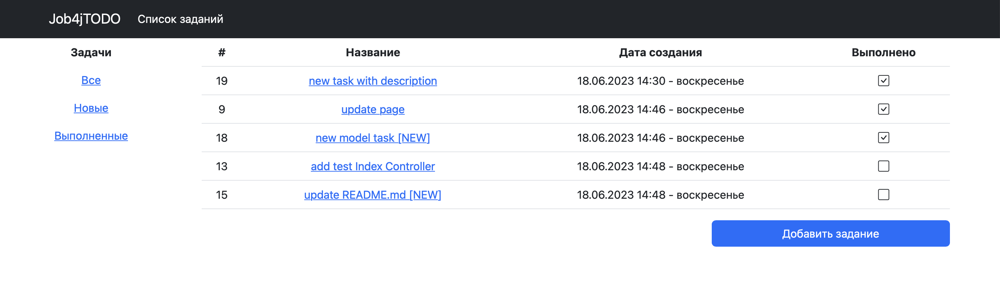
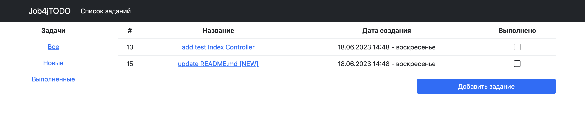
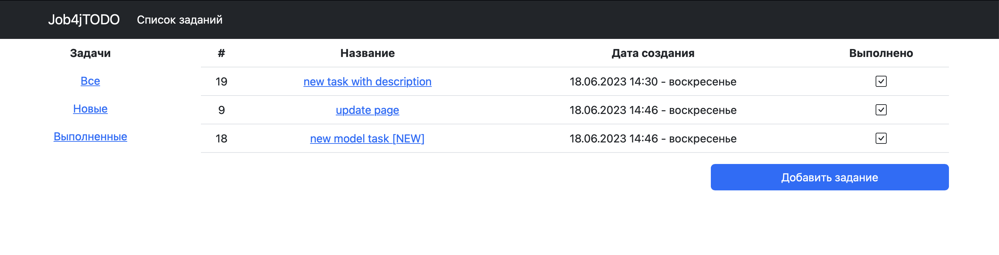

# job4j_todo

+ [О проекте](#Описание-проекта)
+ [Стек технологий](#Для-реализации-проекта-используются)
+ [Требования к окружению](#Требования-к-окружению)
+ [Запуск проекта](#Запуск-проекта)
+ [Взаимодействие с приложением](#Взаимодействие-с-приложением)
+ [Контакты](#Контакты)

## Описание проекта

**Приложение TODO список**

</br>Позволяет *добавлять* задания, *удалять* и *редактировать*.
</br>Каждое задание имеет *название*, *описание*, *дату создания* и *статус выполнения*.
</br>Отображает список всех заданий, выполненных заданий и новых заданий.

## Для реализации проекта используются

+ **Java 17**
+ **Spring Boot 2.7.6**
+ **Hibernate 5.6.11**
+ **Lombok 1.18.22**
+ **Checkstyle 10.3.1**
+ **HTML 5**
+ **Thymeleaf 3.0.15**
+ **Bootstrap 5.2.3**
+ **Postgresql 14**
+ **Liquibase 4.15.0**
+ **H2 2.1.214**
+ **Junit5**
+ **Mockito 3.5.13**

## Требования к окружению

+ **Java 17**
+ **Maven 3.8.7**
+ **Postgresql 14**

## Запуск проекта

+ **Скачайте проект**
  </br><a href="https://github.com/antonglavatskiy/job4j_todo/archive/refs/heads/main.zip">job4j_todo</a>
+ **Создайте базу данных todo_db**
  </br>*username=postgres; password=password*
``` shell 
create database todo_db;
```
+ **Выполните следующие скрипты из директории** *job4j_todo-main/db/scripts*:
  </br>*001_ddl_create_tasks_table.sql*
  </br>*002_ddl_alter_table_tasks_add_title_column.sql*
+ **В терминале перейдите в проект**
+ **Запустите проект**
``` shell 
mvn spring-boot:run
```
+ **В браузере перейдите на страницу**
  </br><a href="http://localhost:8080/index" target="_blank">localhost:8080/index</a>

## Взаимодействие с приложением

Главная страница. Общая информация о ресурсе


Список заданий. Страница со списком всех заданий


Список заданий. Страница со списком новых заданий


Список заданий. Страница со списком выполненных заданий


Добавление задания. Страница добавления нового задания


Задание. Страница с подробным описанием задания


Редактирование. Страница с редактированием задания


## Контакты

+ <a href="https://t.me/GlaAnton">Telegram</a>

***